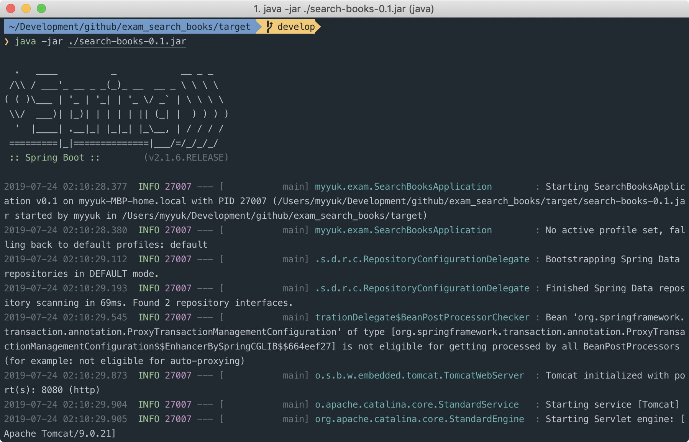
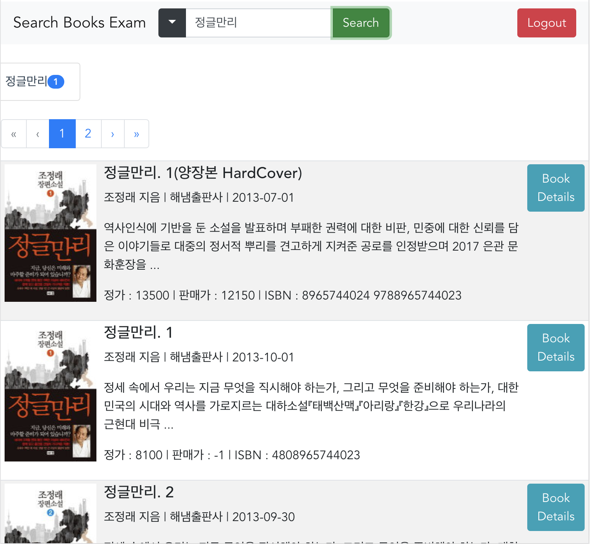

Exam_Search_Books
===

* [다운로드](#다운로드)
* [시스템 요구사항](#시스템-요구사항)  
* [개발환경 및 라이브러리](#개발환경-및-라이브러리)  
* [빌드 및 실행](#빌드-및-실행)  
    * [빌드](#빌드)  
    * [실행](#실행-웹서버) 
* [실행 결과](#실행-결과)
    
## 다운로드
https://github.com/crazysense/exam_search_books/releases/download/v0.1/search-books-0.1.jar

## 시스템 요구사항
* JDK 8 또는 그 이상

## 개발 라이브러리
* Maven SpringBoot, Java8, Tomcat, Simple JSON
* Vue.js, Bootstrap-vue, Webpack
* h2 Database, JPA
* Spring Security, JJWT

## 빌드 및 실행  
### 빌드  
* Maven Download: https://maven.apache.org/download.cgi
* Node.js Download : https://nodejs.org
```console
$ git clone https://github.com/crazysense/exam_search_books.git
$ cd exam_search_books
$ git fetch origin
$ git pull origin master
$ cd frontend
$ npm install
$ npm run build
$ cd ..
$ mvn clean package
```

### 실행
```console
$ cd target
$ java -jar ./search-books-0.1.jar
```

## 실행 결과  
  

  

  

